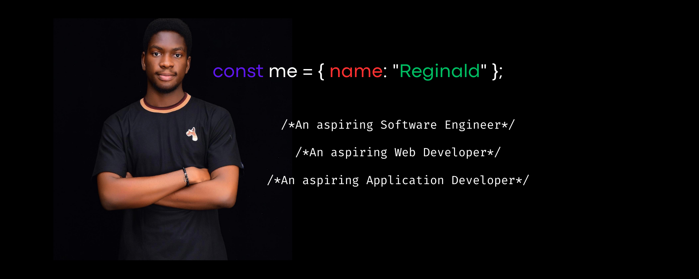

<h3 id="Me">Hello!, I am <a href="https://itsrekas.github.io/Portfolio/">Reginald</a> 👋🏾</h3>

I’m an aspiring software engineer with a passion for web development 💻, design 🎨, application development 📱, and computer security 🔐. As a student at New York University 🏫, I've had the chance to dive deep into data structures, algorithms, and programming languages like C/C++, Python, JavaScript, and React. My internship at the University of Cape Coast 🌍 as a Network Software Engineering Intern also allowed me to sharpen my networking and security skills. I'm excited to continue expanding my knowledge and skill set as I progress through my academic and professional journey 📈.

## Skills:

		

<h1 id="tech-stack">💻Tech Stack </h1>

  
  
  
  
  
   
   
   
  
  
  
  
  
   
  
  
  
  
   
  
   
   
  
  
  
  
  
  
  
  
  
  
   
   
  
  
  
   
  
   
   

## Languages:
- Fluency in English 🇬🇧
- Intermediate French 🇫🇷
